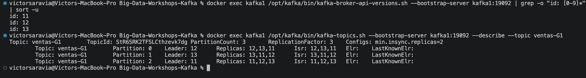
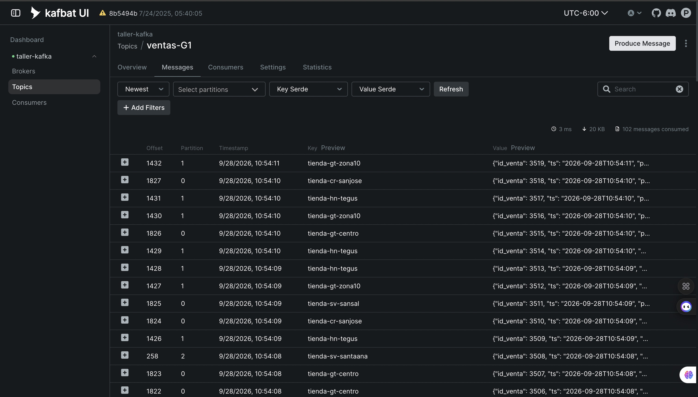
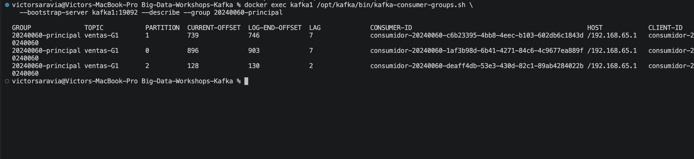
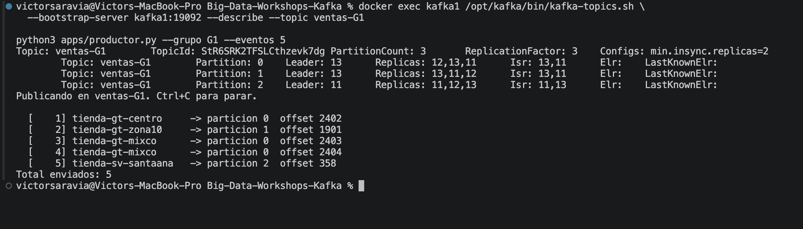
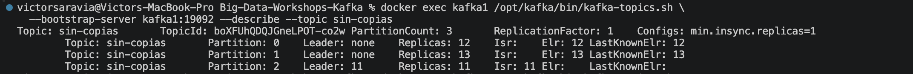
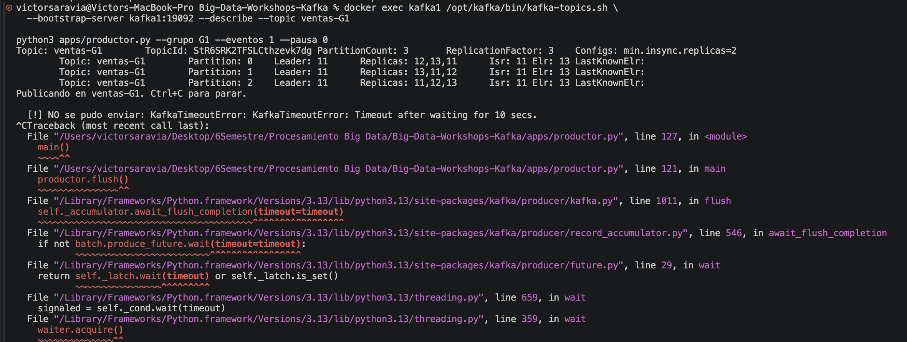
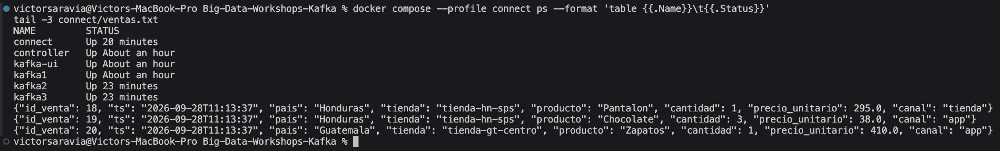

# Bitácora del taller de Kafka

- **Nombre:** Victor Saravia
- **Carné:** 20240060
- **Grupo:** G1
- **Enlace a tu video:** `video-demo.mp4` (en esta misma carpeta)


## 1. Evidencias


### E1. Los tres brokers y el detalle de tu topic (Pasos 6 y 7)




Lo que muestra: Los brokers 11, 12 y 13 están registrados. `ventas-G1` tiene tres particiones y tres réplicas; sus líderes son 12, 13 y 11, y los tres IDs aparecen en cada `Isr`.

### E2. La interfaz web con tu topic de ventas (Paso 8)



Lo que muestra: Kafbat UI muestra mensajes reales de `ventas-G1`. Se ven las claves de tienda, la partición, el offset y la vista previa del JSON de cada venta.

### E3. Varios consumidores repartiéndose las particiones (Paso 8)



Lo que muestra: El grupo `20240060-principal` reparte las tres particiones entre tres consumidores con IDs distintos. La columna `LAG` muestra mensajes pendientes de lectura.

### E4. Falla de un broker (Paso 9)



Lo que muestra: Tras detener `kafka2`, cada `Isr` quedó con dos brokers (11 y 13). El productor envió cinco ventas sin errores y Kafka eligió al broker 13 como nuevo líder de la partición 0.

### E5. Escrituras rechazadas (Paso 10)





Lo que muestra: En `sin-copias`, las particiones 0 y 1 quedaron con `Leader: none`. En `ventas-G1` solo quedó el broker 11 en `Isr` y el productor recibió `KafkaTimeoutError` al intentar escribir.

### E6. Kafka Connect escribiendo el archivo (Paso 11)



Lo que muestra: El servicio `connect` está activo y las últimas líneas de `connect/ventas.txt` son eventos JSON de `ventas-G1`; aparecen ventas con IDs 18, 19 y 20 de la nueva corrida.

## 2. Preguntas


**1. ¿Qué guarda el controller y qué guarda cada broker? Justifícalo con lo que viste, y compáralo con el NameNode y los DataNodes del taller anterior.**

El controller mantiene la información del clúster: topics, particiones y líderes. En su disco vi `__cluster_metadata-0`, pero no carpetas de ventas. En `kafka1` sí aparecieron `ventas-G1-0`, `ventas-G1-1` y `ventas-G1-2`, donde el broker guarda mensajes. Se parece al NameNode y a los DataNodes de Hadoop: uno coordina y los otros almacenan los datos.

**2. Con tu `--describe`: ¿cuántas particiones tiene tu topic, quién es líder de cada una y qué significa que el Isr tenga tres entradas?**

Mi topic `ventas-G1` tiene tres particiones. En la captura E1, los líderes fueron 12 para la partición 0, 13 para la 1 y 11 para la 2. Cada `Isr` mostraba 11, 12 y 13: las tres copias estaban al día y podían respaldar una escritura confirmada.

**3. Produjiste con la tienda como clave. ¿Por qué una misma tienda cae siempre en la misma partición y qué garantía de orden te da eso? ¿Qué perderías si produjeras sin clave?**

El productor usa el nombre de la tienda como clave; Kafka calcula la partición a partir de esa clave. Por ejemplo, `tienda-gt-mixco` apareció varias veces en mi partición 0 con offsets consecutivos. Así se conserva el orden de esa tienda. Sin clave, sus eventos podrían ir a particiones distintas y perderíamos esa garantía de orden.

**4. Corriste dos, tres y cuatro consumidores en el mismo grupo de lectura. ¿Qué pasó con el cuarto y por qué? ¿Qué cambió con un `--grupo-lectura` distinto?**

Con dos consumidores del grupo `20240060-principal` se repartieron las tres particiones; con tres, cada uno recibió una. Al abrir un cuarto, solo aparecieron tres `CONSUMER-ID` en el `--describe`, porque no quedaba partición libre. El grupo `20240060-auditoria` mantuvo offsets propios y pudo leer desde el comienzo.

**5. Al detener brokers, en un caso el productor siguió y en otro falló. Explica por qué, y relaciona `acks` y `min.insync.replicas` con la C y la A del teorema CAP.**

Con `kafka2` apagado quedaron dos réplicas en `Isr` (11 y 13), y el productor envió cinco ventas. Al apagar también `kafka3`, quedó solo 11: `acks="all"` y `min.insync.replicas=2` hicieron que Kafka rechazara la escritura con un timeout. En esa operación se priorizó la consistencia de los datos confirmados (C) sobre aceptar escrituras durante la falla (A).

**6. Sacaste los datos a un archivo con tu consumidor y con Kafka Connect. ¿Qué tuviste que resolver para que Connect funcionara, y en qué caso real preferirías cada forma?**

Mi consumidor Python guardó 20 eventos en `salida/ventas-G1.jsonl`; Connect escribió más de 5 500 en `connect/ventas.txt` y añadió 20 al publicar una nueva corrida. Para Connect tuve que usar `kafka1:19092` dentro de Docker, `StringConverter` para el JSON plano y `plugin.path` para cargar FileStreamSink. Preferiría Connect para copiar datos sin lógica especial y Python si necesito transformar o filtrar.

## 3. Mini-reto de tu grupo

**Pregunta asignada a tu grupo:** ¿Qué país concentra más ventas en dinero (`cantidad × precio_unitario`)? Total por país, de mayor a menor.

**Tu programa** (también va como `mini-reto.py`):

```python
from collections import defaultdict
from decimal import Decimal
import json
from pathlib import Path

ruta = Path("salida/ventas-G1.jsonl")
totales = defaultdict(Decimal)
conteo = 0

with ruta.open(encoding="utf-8") as archivo:
    for linea in archivo:
        venta = json.loads(linea)
        monto = Decimal(str(venta["cantidad"])) * Decimal(str(venta["precio_unitario"]))
        totales[venta["pais"]] += monto
        conteo += 1

if conteo != 2000:
    raise SystemExit(f"Se esperaban 2000 eventos; encontré {conteo}")

for pais, total in sorted(totales.items(), key=lambda par: par[1], reverse=True):
    print(f"{pais}: Q{total:,.2f}")
```

**Resultado de tu programa** — la salida tal como la imprimió, y también la línea del `wc -l`:

```
    2000 salida/ventas-G1.jsonl
Guatemala: Q1,413,807.00
Honduras: Q1,199,651.00
Costa Rica: Q920,581.00
El Salvador: Q579,114.00
```

**Interpretación en una frase:** En mis 2000 ventas, Guatemala concentró el mayor monto (Q1,413,807.00), Q214,156.00 más que Honduras, que ocupó el segundo lugar.

## 4. Problemas encontrados (opcional)

